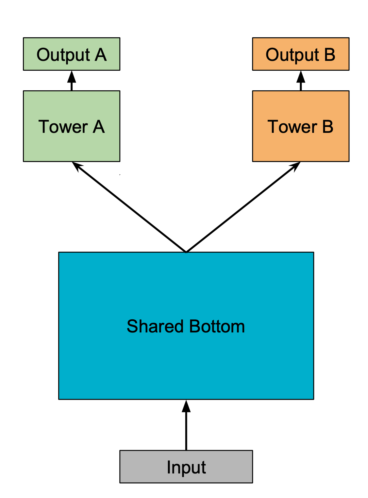
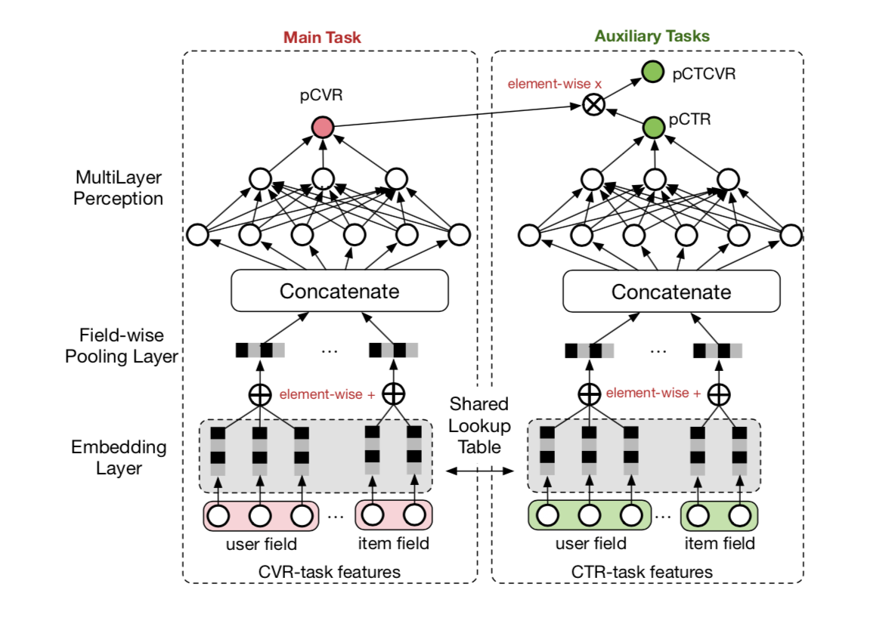
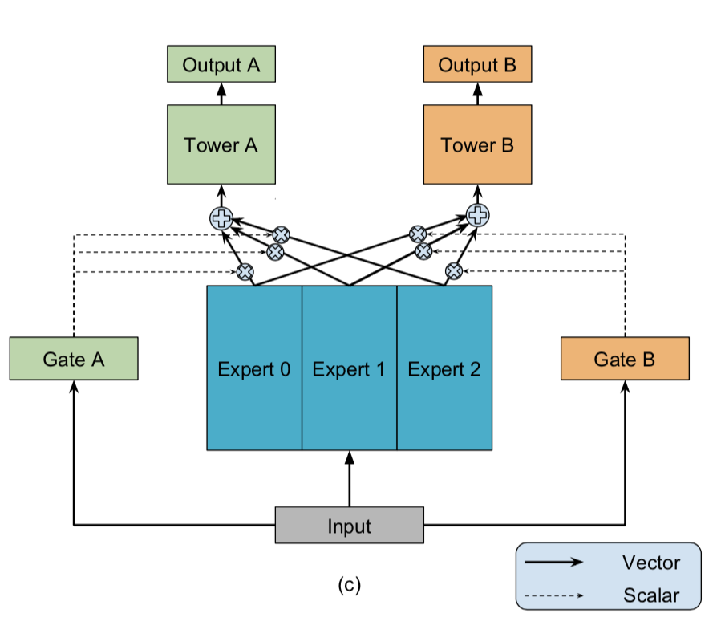
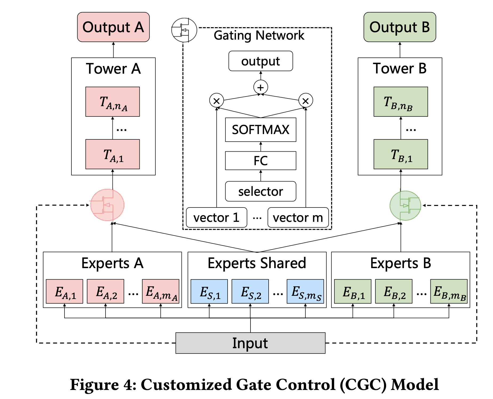
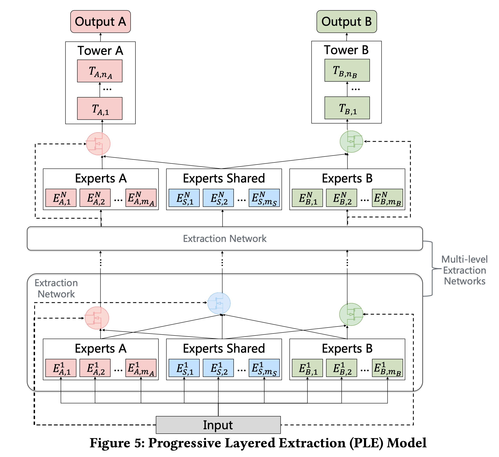

# multi_task_learning

Multi-task Learning Models for Recommender Systems

This project is developed based on [DeepCTR](https://github.com/shenweichen/DeepCTR) :https://github.com/shenweichen/DeepCTR.

You can easy to use the code to design your multi task learning model  for multi regression or classification tasks.

### [Example 1](demo.ipynb)

Dataset: http://archive.ics.uci.edu/ml/machine-learning-databases/adult/

Task 1: (Classification) aims to predict whether the income exceeds 50K.

Task 2: (Classification) aims to predict this person’s marital status is never married.

### Example 2

Dataset: https://archive.ics.uci.edu/ml/machine-learning-databases/census-income-mld/

*Preparing*

|               模型                |              简介              |                             论文                             |
| :-------------------------------: | :----------------------------: | :----------------------------------------------------------: |
| [Shared-Bottom](shared_bottom.py) |         shared-bottom          | [Multitask learning](http://reports-archive.adm.cs.cmu.edu/anon/1997/CMU-CS-97-203.pdf)(1998) |
|          [ESMM](essm.py)          | Entire Space Multi-Task Model  | [Entire Space Multi-Task Model: An Effective Approach for Estimating Post-Click Conversion Rate](https://arxiv.org/abs/1804.07931)(SIGIR'18) |
|          [MMoE](mmoe.py)          | Multi-gate Mixture-of-Experts  | [Modeling Task Relationships in Multi-task Learning with Multi-gate Mixture-of-Experts](https://dl.acm.org/doi/abs/10.1145/3219819.3220007)(KDD'18) |
|         [CGC](ple_cgc.py)         |    Customized Gate Control     | [Progressive Layered Extraction (PLE): A Novel Multi-Task Learning (MTL) Model for Personalized Recommendations](https://dl.acm.org/doi/10.1145/3383313.3412236)(RecSys '20) |
|           [PLE](ple.py)           | Progressive Layered Extraction | [Progressive Layered Extraction (PLE): A Novel Multi-Task Learning (MTL) Model for Personalized Recommendations](https://dl.acm.org/doi/10.1145/3383313.3412236)(RecSys '20) |

## Shared-Bottom

 

## ESMM

 

## MMOE

## CGC

## PLE

